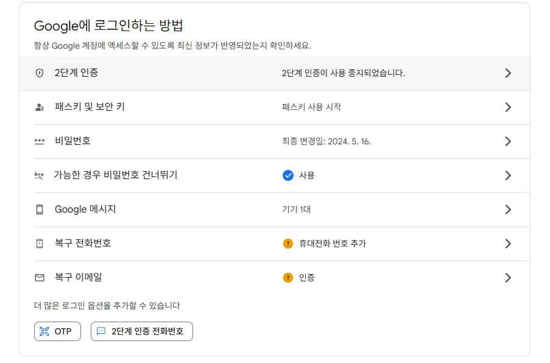
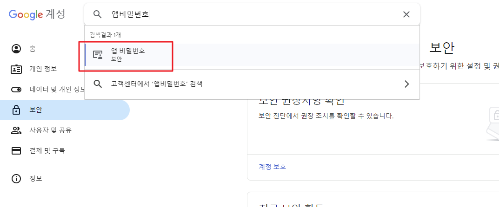
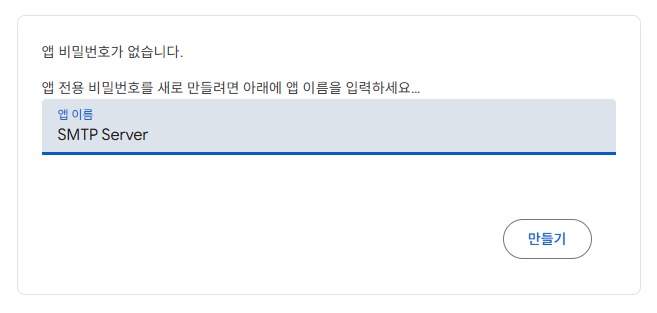
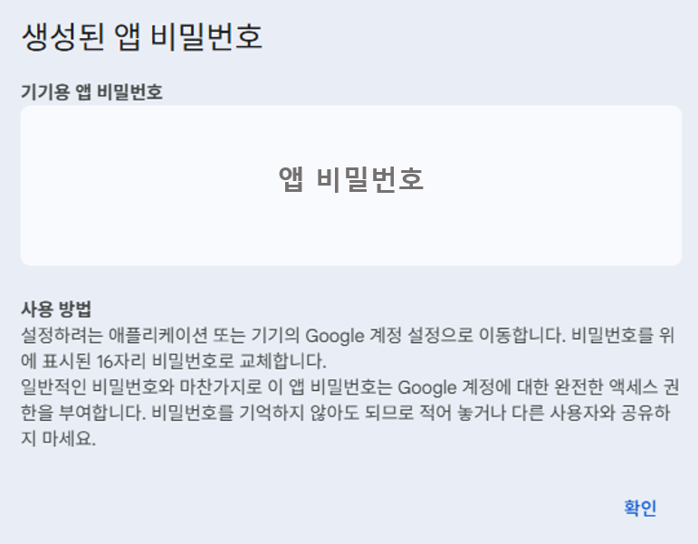

# 📧 Gmail SMTP 앱 비밀번호 발급 매뉴얼

## 1. 구글 계정 로그인
- [https://myaccount.google.com/](https://myaccount.google.com/) 접속
- SMTP를 사용할 Gmail 계정으로 로그인

## 2. Gmail의 IMAP 설정
- Gmail 설정 페이지 접속
- 전달 및 POP/IMAP 탭 이동
- IMAP 사용 체크

## 3. 2단계 인증 설정 확인
앱 비밀번호를 사용하려면 **2단계 인증이 반드시 활성화되어 있어야 함**

### 설정 방법:
- 왼쪽 메뉴에서 `보안` 클릭
- 
- `2단계 인증` 항목에서 활성화되어 있는지 확인  
  → 미설정인 경우, 지시에 따라 설정 진행

## 4. 앱 비밀번호(App Password) 생성
1. 다시 `보안` 메뉴로 이동
2. 검색창에 `앱 비밀번호` 검색
    
2. `앱 비밀번호` 항목 클릭  
   → 보안 수준에 따라 로그인 재확인 필요할 수 있음
3. 앱 만들기
    - 앱 이름 : (예: `SMTP Server`)
    
4. `생성` 클릭

- **16자리 비밀번호가 생성됨**  
- 이 비밀번호는 복사해두어야 하며, 다시 확인할 수 없음
- 앱 비밀번호를 분실하였을 경우, 재확인이 어렵기 때문에 앱 비밀번호를 다시 생성해야함 
- **앱 비밀번호 사용 시, 공백없이 사용**

## 5. SMTP 설정 정보

| 항목            | 값                                |
|----------------|-----------------------------------|
| SMTP 서버 주소 | `smtp.gmail.com`                  |
| 포트 (SSL)     | `465`                             |
| 사용자 이름    | 본인의 Gmail 주소 (`example@gmail.com`) |
| 비밀번호       | 위에서 생성한 **앱 비밀번호** 사용 |

## 6. 참고 사항
- 앱 비밀번호는 일반 로그인용 비밀번호와는 다르며, **SMTP/IMAP 연동용으로만 사용됨**
- 앱 비밀번호는 **언제든지 삭제 가능**하며, 삭제 시 관련 앱에서는 다시 인증 필요

## 7. PMS 적용 방법
- 관리자 계정으로 접속
- 관리자 > 설정관리 메뉴 접속
- 내용 작성
  - SMTP 계정 - 본인 Gmail 계정
  - SMTP 비밀번호 - 발급받은 앱 비밀번호 **(공백없이 사용)**
